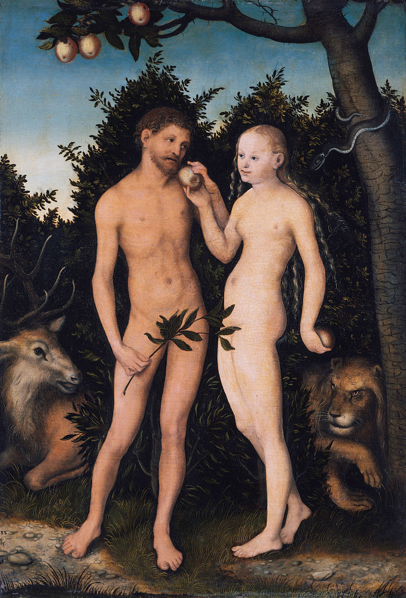
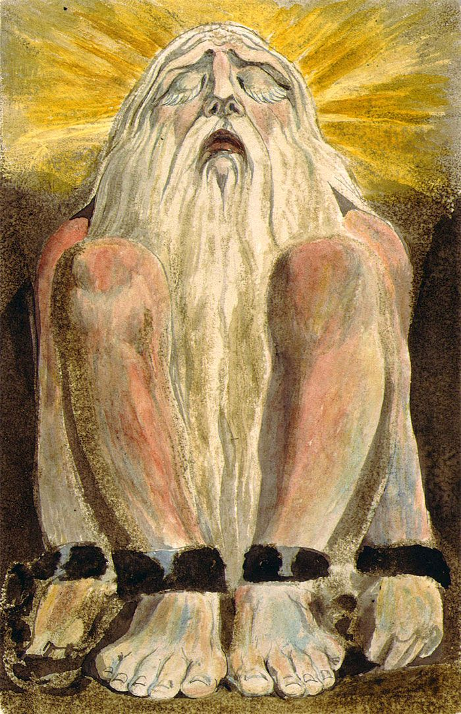
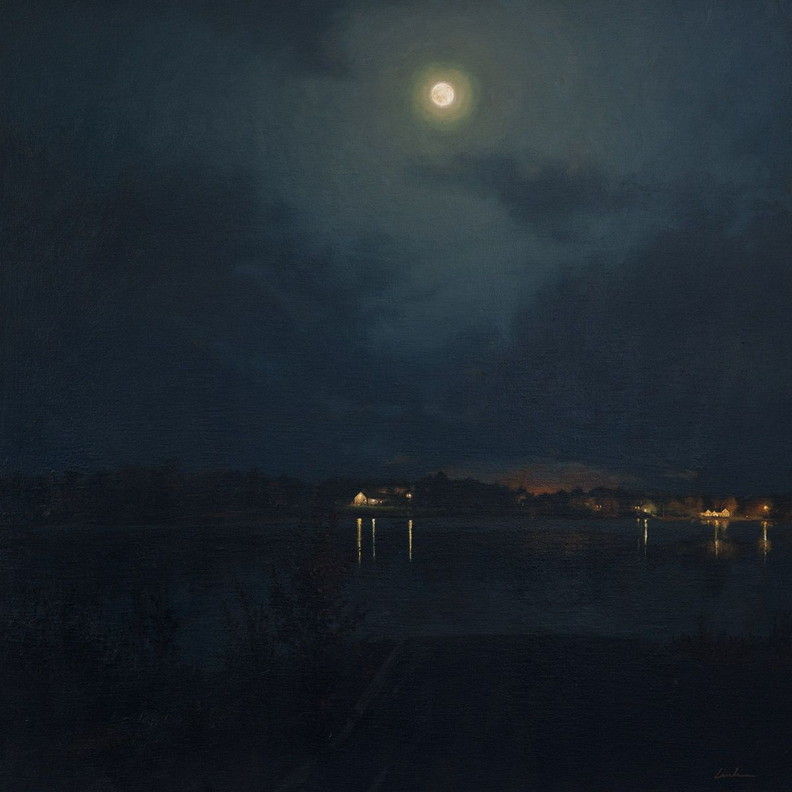
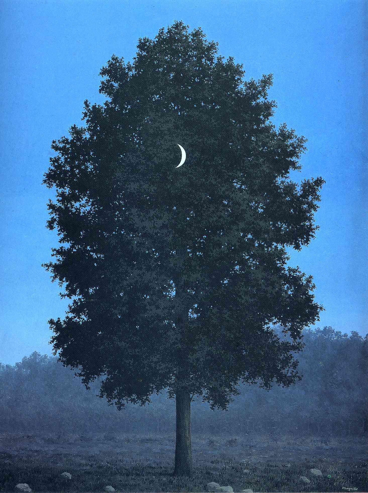

*“Awake, arise or be for ever fall’n.” John Milton, Paradise Lost*

Being conscious is quite *strange*, we are all awake after an eternity of sleep.

Something which can help us frame our perplexing situation is the creation myth known as "Adam and Eve". This story reaches a crescendo when Eve, tempted by lucifer himself, eats from the tree of knowledge. Prior to this Eve and Adam were safe in paradise; safe from the opera of being. This paradisiacal state has been lost and we all work feverishly in order to reclaim a piece of its perfection. This parable can help us track the journey of the small, fragile yet defiant creatures who stand conscious beneath an infinite and silent universe.

Before the emergent phenomena consciousness appeared our species lived in an unconscious glow, there was only the world of the externality; a world were we swam in the eternal pond of our instincts. This is when we as animals were whole and complete like every other animal on this spinning rock. This however did not last long for we bit from the cursed apple; we defied our "creator" and now are conscious. We entered into the world of symbols and abstractions, a world which was only meant previously for the gods, yet here we are.

This fall from celestial heights was put eloquently by poet John Milton:

*"Of Mans First Disobedience, and the Fruit
Of that Forbidden Tree, whose mortal tast
Brought Death into the World, and all our woe,
With loss of Eden"*

This was the point in time when we awoke as man not beast, this is were *all* our trouble began.
Here we can postulate the following: Occasionally, pulsating lights of true self-consciousness, as we know it now, began to flash at us archaic beasts only to be pushed painfully back down; for direct exposure to such clear crystallising lights is blinding and nauseating. We rose out of the blissful, sub-terrain slumber that encapsulated us for quite some time — now we have come face to face with the glistening sun of existence; our consciousness chained within this decaying fleshy case.

This is the aphorism that one extracts from our shared story: We are alive, awake and conscious, forever striving to be something rather than nothing. Our species is never content with our being, unlike the other creatures on earth we work desperately to be not *just* another biological organism. If we were to look to the domesticated house cat we see something which is already complete and fulfilling its destiny with each passing moment; we won an intellect, it won serenity, we cannot imagine that *peace*.

In order to buffer against our inherent inner void we created elaborate stories and myths to give importance to our place in the cosmos, to comfort our brothers and sisters. These stories painted us fleeting primates as the centre of the universe, our pre-scientific worldview could assert such triumphant proclamations as:

- We are held in the image of perfection itself.

- Our being is one of cosmic splendour and importance.
- We have a fundamental essence.   

As nice as that sounds this is not the world we live in currently. As us modern folk move up our chains of cognitive abstractions we hit the apex of thought when we conceptualise that someday our life will be sucked back into the nothingness we emerged from. To archaic man this mode of thought ends with a peaceful return to eternal beauty, as he moves up towards the apex of cognition he is greeted with the gentle reminder that his soul is immortal and god shall warmth him soon. Primal man could never predict that we would be left to view the cosmos *stripped* of the sacred.

So neither god or state can save us now, rather we must create and rediscover our own purpose from within; *fantastic*.

But, one can still ask: what sick faith would allow an animal to know its dreaded destiny? If we are now to think of being in its fullest sense it requires the destruction of all illusions and repressions — true powers of self-referentiality result in harrowing, dizzying experiences; but what use is possessed in this activity? To not lie about your nature and your destiny, that is the affirmation of *being*. This however is a difficult task.

When we look at the sun we are blinded down towards the dark unconscious realm; one which wraps around us like the depths of an bottomless ocean – tragically, our tale has cast our species as merely feeble divers with ebbing amounts of breath, if we do not plan our descent we will surely *drown*.
So, it makes sense to first sketch a map of our terrain before we dive too deep into the underworld of being. This is what the metaphor formerly presented states: with our gods *dead* existence demands a robust reformulation.

Even in the book of Genesis the authors could see the paradox of our species:  

  “*the eyes of both of them were opened, and they realized they were naked*;”

We at once awoke to our nature while standing naked before the cosmos, this is the true paradox of being. To be self-aware but nude, vulnerable but weak; one can imagine these early primates to use their advanced cognitive abilities to ask the blatant questions:

**1).** Who has left us here?

**2).** Why us?

According to the book of Genesis we disobeyed our creator and now must face our existence alone, each man, woman and child *witness* to the horrors of being. Yet, that is just one way to frame our situation, alternatively we could kiss the same truth from the lips of the fallen gods and still, in spite of the futility, strive for totality. That would be something truly virtuous. Who then will we be when the night looks down on our mortal flesh and no judgement reigns from the blessed isles, will we still act as towers of divinity who rise purposefully above the dirt we will all soon rot beneath? Our time is  limited as a species, eternities passed without us and someday the universe will rest peacefully without us stridently tugging on its matter. If we remain honest about being then we can possess some humility in the face of our predicament, that could be true atonement with *life*.

It made sense in the past to distort our species most fatal axiom: regardless of your actions there is simply no way to prevent the annihilation of your psyche. Your dynamic patterns of neuronal connections will soon be dust and dirt. Fair enough, before we were scared and confused — we could not yet bear such a shattering truth. Now however, *we* can step forward with this truth in hand and man alone can decide his own purpose, this could justify any *destruction*.

We once asked the question with fear in our hearts: *who will be the arbiter of this twisted fate?* The gods remained silent so now it seems right that we alone step forth. Our eyes can witness the flickering stars, the glimmering ocean and the scintillating moon; in the middle of an incomprehensible infinity we can see these almost divine images all around us, this provides us proof that *being* has worth.

One can find truth in the poetic words of Blaise Pascal:

  *“Man is only a reed, the weakest in nature, but he is a thinking reed. But even if the universe were to crush him, man would still be nobler than his slayer, because he knows that he is dying and the advantage the universe has over him. The universe knows none of this.”*

Thus, It seems to acquire such meaning in this life we must awake to our nature; this rather than to forever be falling, to forever be asleep. As the saying goes, we are the children of chance and misery, this does not negate *being* rather rejuvenates it; for we alone know our faith and can act in accordance to it, that is **courage**.
